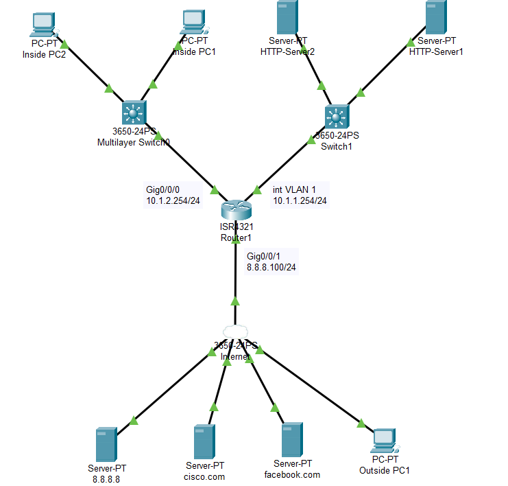
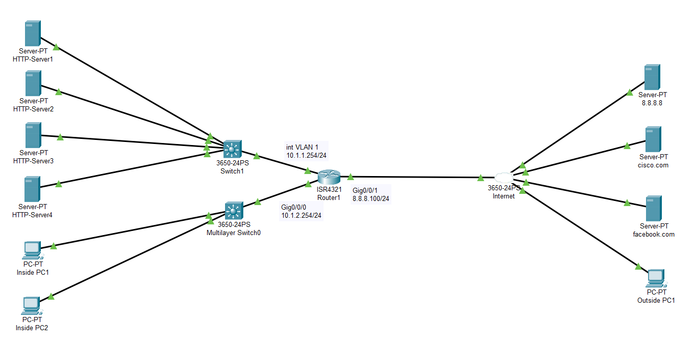

An illustration of Access Control List on a Router 4321 in the network is illustrated here.

Here ACL number 100 was created to restrict the traffic internally using Router as follows:

- Inside PC1 can only access the inside HTTP-Server 1 using HTTP on subnet 10.1.1.0/24.

- Inside PC2 can only access the inside HTTP-Server 2 using HTTPS on subnet 10.1.1.0/24.
 
- No other PCs or Servers on subnet 10.1.2.0/24 can access subnet 10.1.1.0/24 (Explicitly add this line. This is normally done to log the traffic with the word log, but PT does not support logging).
 
- Hosts on subnet 10.1.2.0/24 can access any other network.
 
This Extended ACL 100 was binded to the interface Gig0/0/0 of the Router.

*******************************************************************************************************************************************************************************

An illustration of Access Control List on a Router 4321 in the network is illustrated here.

Here ACL number 100 was created to restrict the traffic internally using Router as follows:

- Inside PC1 can only access the inside HTTP-Server 1 using HTTP on subnet 10.1.1.0/24.

- Inside PC2 can only access the inside HTTP-Server 2 using HTTPS on subnet 10.1.1.0/24.
 
- No other PCs or Servers on subnet 10.1.2.0/24 can access subnet 10.1.1.0/24 (Explicitly add this line. This is normally done to log the traffic with the word log, but PT does not support logging).
 
- Hosts on subnet 10.1.2.0/24 can access any other network.
 
This Extended ACL 100 was binded to the interface Gig0/0/0 of the Router.
