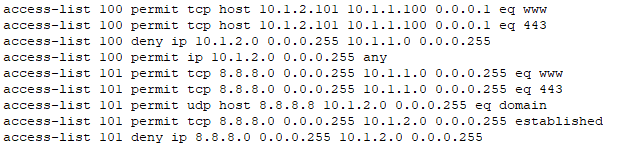

An illustration of Access Control List on a Router 4321 in the network is illustrated here.

Here ACL number 100 was created to restrict the traffic internally using Router as follows:

- Inside PC1 can only access the inside HTTP-Server 1 using HTTP on subnet 10.1.1.0/24.

- Inside PC2 can only access the inside HTTP-Server 2 using HTTPS on subnet 10.1.1.0/24.
 
- No other PCs or Servers on subnet 10.1.2.0/24 can access subnet 10.1.1.0/24 (Explicitly add this line. This is normally done to log the traffic with the word log, but PT does not support logging).
 
- Hosts on subnet 10.1.2.0/24 can access any other network.
 
This Extended ACL 100 was binded to the interface Gig0/0/0 of the Router.

*******************************************************************************************************************************************************************************

Second illustration of Access Control List on a Router 4321 in the network is illustrated also here.

In this illustration two ACLs were created, one for the internal network (ACL 100) and other for the outside network (ACL101).

ACL number 100 was created to restrict the traffic internally using Router as follows:

- Inside PC 1 on subnet 10.1.2.0/24 can only access HTTP-Servers 1 and 2 on subnet 10.1.1.0/24 using HTTP and HTTPS.
 
- No other PCs or Servers on subnet 10.1.2.0/24 can access subnet 10.1.1.0/24 (Explicitly add this line. This is normally done to log the traffic with the word log, but PT does not support logging).
 
- Hosts on subnet 10.1.2.0/24 can access any other network.
 
This Extended ACL 100 was binded to the interface Gig0/0/0 of the Router.

ACL number 101 was created to restrict traffic externally as follows:

- Any external device can access internal HTTP Servers using HTTP or HTTPS.
- 
- No external device can access the user subnet 10.1.2.0/24 (Explicitly add this line. This is normally done to log the traffic with the word log, but PT does not support logging).

This Extended ACL 101 was binded to the interface Gig0/0/1 of the Router.

