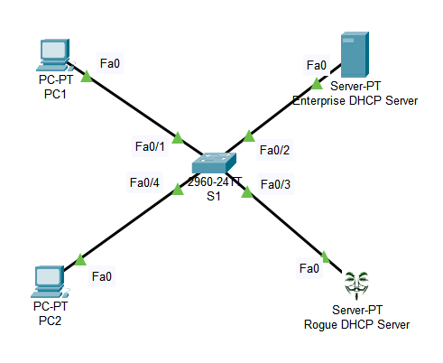

An illustration of Rogue DHCP Server trying to provide IPv4 addresses in network and act as a DHCP Server is depicted here. The Rogue DHCP Sever then tries to monitor the traffic in the network.

By simply configuring the Switchport DHCP Snooping Trust, we can avoid the Rogue DHCP Server from interfering in the network.
