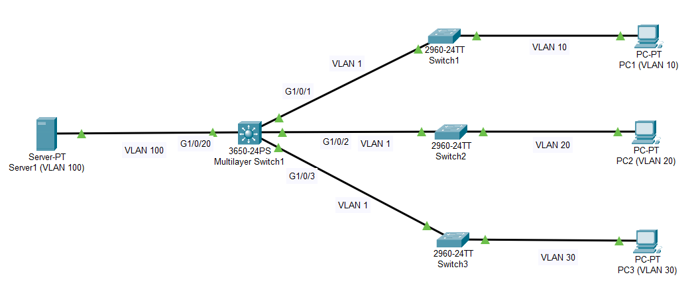

Here, I have created four different VLANs between End devices and Switches.

The Multilayer Switch (Core) is enabled for interVLAN routing. The switchports between the Switches are enabled as VLAN Trunk port. And the switchports between Switch and the End devices are enabled as VLAN Access port.
