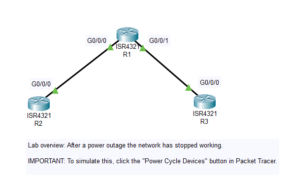

A short part of network is depicted to have stopped working after a power outage. Three Routers facing three different problems like router not booting properly, Router's running-configuration lost are illustrated in this lab.

Configuration Register Setting to 0x2102, refer: https://www.cisco.com/c/en/us/support/docs/routers/10000-series-routers/50421-config-register-use.html
