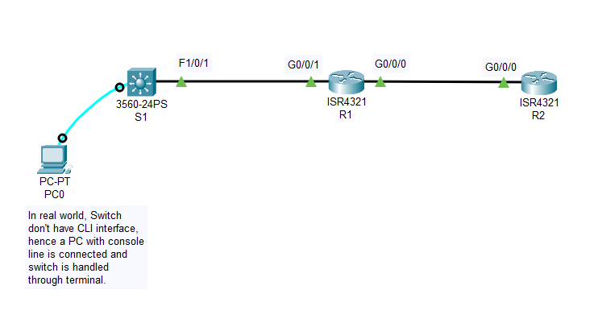

An illustration of lost Enable or Console Login Password, and how to replace a lost Enable Secret Password on Routers and Switches.

Here I have used Cisco 4000 Series Routers and Cisco 3000 Series Switch in this lab.

Detailed process for Routers: https://www.cisco.com/c/en/us/td/docs/routers/access/4400/troubleshooting/guide/isr4400trbl/isr4400trbl02.html

Detailed process for Switches: https://www.cisco.com/c/en/us/support/docs/switches/catalyst-2950-series-switches/12040-pswdrec-2900xl.html
