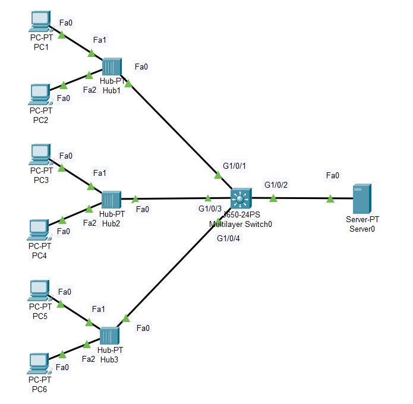

An illustration of Port Security of a Switch in the network is illustrated here. Each port of the Switch in the above network is configured with different port security methods.

Int G1/0/1 (Hub 1) : Allowing just one PC to use port, the first PC to send the traffic through the port registers itself to use that port. *(Dynamic Configured method)*

Int G1/0/3 (Hub 2) : Automatically adding the MAC address to the running configuration when the first PC sends the traffic through the port. *(Secure Sticky method)*

Int G1/0/4 (Hub 3) : Port Security by manually specifying PC5's MAC address. *(Secure Configured method)*

*NOTE:* When the second PC on any of the above ports trys to send the traffic through the Switch port, that port of the Switch automatically goes down. Thus, Securing the network.
