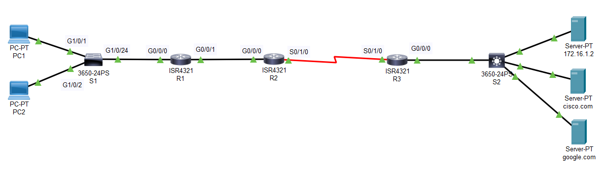

Here, I have created a basic Routing scenerio with three Routers configured with Static Routing, two End devices and a DNS server.

The Routers are configured with STATIC ROUTES using next Hop IP addresses and not using the Default Routes.
