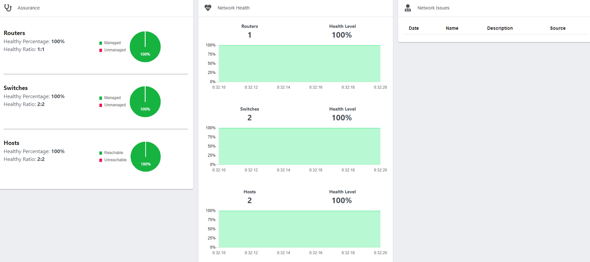
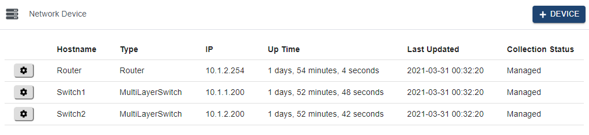
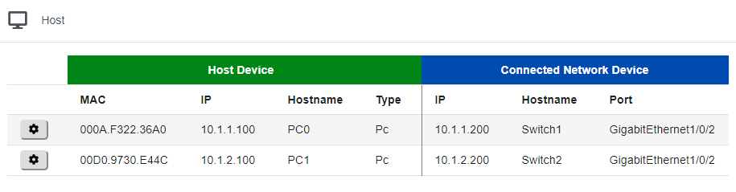
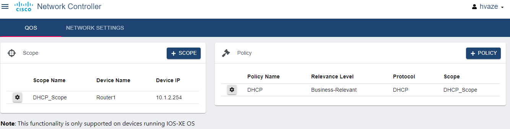
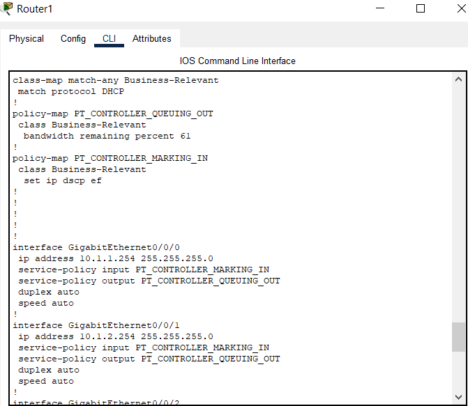

## Cisco Packet Tracer's new update consists of Network Controller (SDN Controller) with great user interface.

Here an illustration of SDN Controller is demonstrated in the following network.


*******************************************************************************************************************************************************************************


## Dashboard view of Controller displaying the overview of Controller.


*******************************************************************************************************************************************************************************





*******************************************************************************************************************************************************************************


## Network Devices accessible through Controller in the network.




*******************************************************************************************************************************************************************************


## Hosts that can be reached by Controoler in the network.




*******************************************************************************************************************************************************************************


## This complete network by discovered just by connecting to single interface (10.1.1.254) of Router.


*******************************************************************************************************************************************************************************


## Topology seen on the Controller.


*******************************************************************************************************************************************************************************

````
## Tracing path between in any end points in the network.


````
*******************************************************************************************************************************************************************************


## Easily deploying Policies to the Network devices from the Controller.

Here DHCP policy was deployed on Router.




*******************************************************************************************************************************************************************************


## Successfull implementation of DHCP policy in Router.




Also API programming capabilities can be accessed from the host PC using real-world programming tools (curl, Python requests, VS code).
