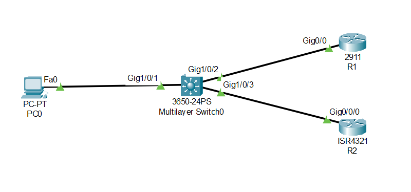

Here, I have created a basic SNMP (Simple Network Management Protocol) scenario with two Routers enabled with SNMP and a PC to manage the Network.

In PC, I have used MIB (Management Information Base) Browser to manage and get statics about the two Routers using SNMP.
